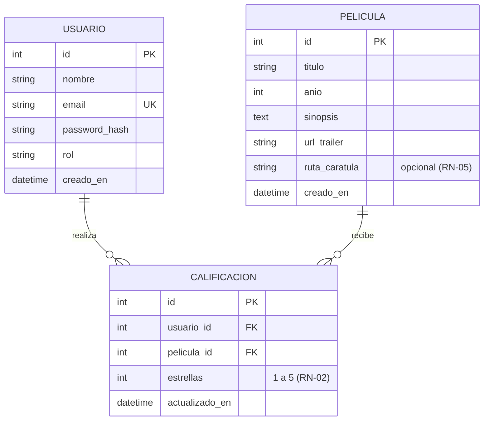
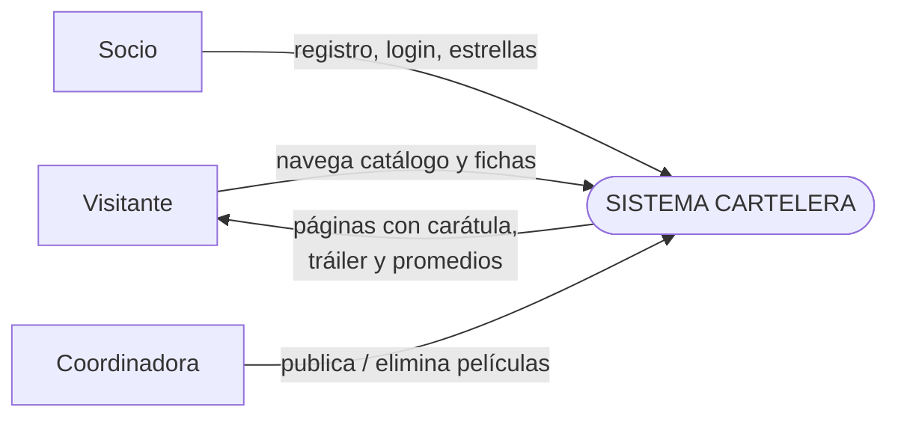
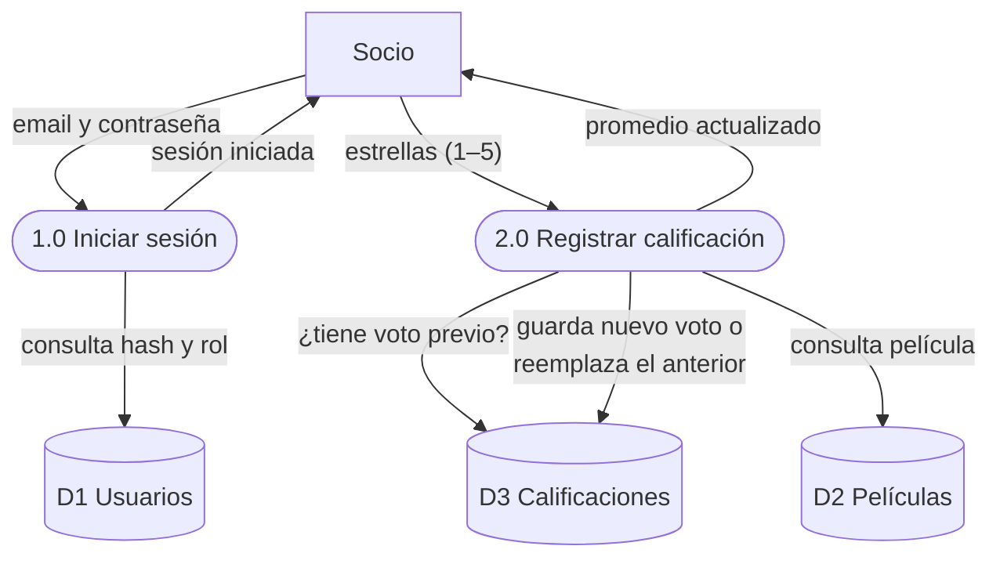
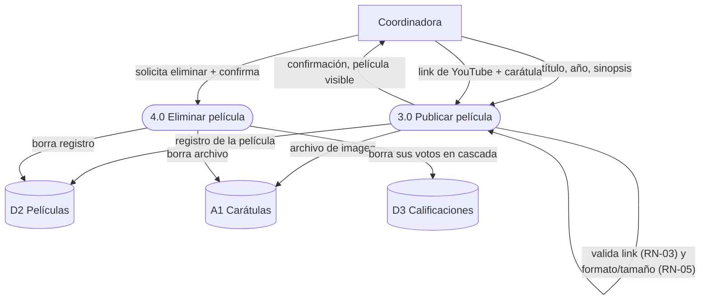
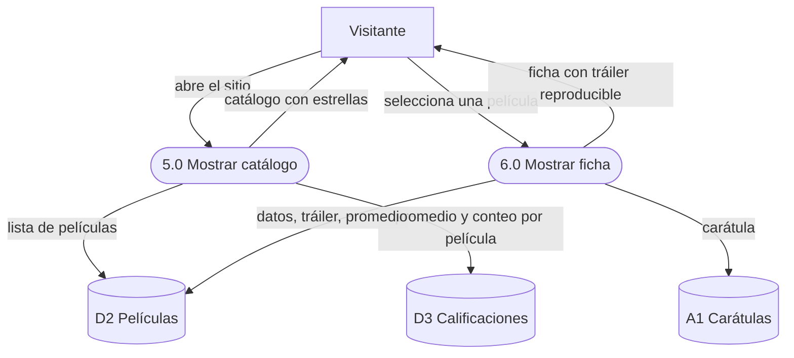

# Fase 3 — Diseño del Sistema: Cartelera

> **Módulos:** ISI601 Taller de Diseño de Sistemas · ISI602 Arquitectura de Software
> **Fase del ciclo de vida:** 3. Diseño
> **Insumo obligatorio:** `02_requerimientos.md` — cada elemento de este diseño **nace de un requerimiento** (RF/RNF/RN/HU) y la trazabilidad está en §6.
> **Alcance de la fase:** se diseña QUÉ estructuras, procesos y pantallas resuelven los requerimientos, **aún sin elegir tecnología** (framework, base de datos específica, etc. — eso es la fase 4).
> **Fecha:** 2026-08-23

> **Nota técnica:** los diagramas están escritos en **Mermaid** para renderizarlos con el pipeline habitual (`herramientas/.mermaid`). Alumnos: un diagrama que no se puede redibujar es un diagrama muerto.

---

## 1. Qué diseña este documento

| Sección | Diseña | Responde a |
|---|---|---|
| §2 | Los **datos** (modelo relacional + diccionario) | RF-01…RF-09, RN-01, RN-02, RN-05, RNF-01 |
| §3 | Los **procesos** (diagrama de contexto + DFD) | HU-01…HU-07, procesos de `02_requerimientos.md` §9 |
| §4 | La **interfaz** (4 pantallas, wireframes) | RF-02…RF-09, RNF-06, C4 (celular) |

---

## 2. Diseño de datos

### 2.1 Diagrama entidad-relación



**Lectura del diagrama:** un USUARIO realiza **cero o muchas** calificaciones (el visitante recién registrado aún no califica); una PELICULA recibe **cero o muchas** (la película recién publicada aún no tiene votos); cada CALIFICACION pertenece a exactamente **un** usuario y **una** película.

### 2.2 Diccionario de datos

**Entidad USUARIO** (soporta RF-01, RF-02, RNF-01)

| Atributo | Tipo | Longitud | Obligatorio | Restricción / origen |
|---|---|---|---|---|
| id | Entero | — | Sí | Identificador (clave primaria) |
| nombre | Texto | 80 | Sí | Mínimo 2 caracteres (RF-01) |
| email | Texto | 120 | Sí | **Único**, formato de email (RF-01) |
| password_hash | Texto | 200 | Sí | Solo el hash bcrypt, jamás la contraseña (RNF-01) |
| rol | Texto | 20 | Sí | 'socio' o 'admin' (RN-04) |
| creado_en | Fecha/hora | — | Sí | Automático al registrarse |

**Entidad PELICULA** (soporta RF-04 a RF-07, RN-03, RN-05)

| Atributo | Tipo | Longitud | Obligatorio | Restricción / origen |
|---|---|---|---|---|
| id | Entero | — | Sí | Identificador (clave primaria) |
| titulo | Texto | 120 | Sí | No vacío (RF-04) |
| anio | Entero | — | Sí | Numérico (RF-04) |
| sinopsis | Texto largo | 1000 | No | Texto libre |
| url_trailer | Texto | 300 | Sí | Link de YouTube **ya convertido a formato embebido** (RN-03) |
| ruta_caratula | Texto | 300 | No | Nombre del archivo guardado; vacío → imagen genérica (RN-05) |
| creado_en | Fecha/hora | — | Sí | Automático al publicar |

**Entidad CALIFICACION** (soporta RF-08, RF-09, RN-01, RN-02)

| Atributo | Tipo | Longitud | Obligatorio | Restricción / origen |
|---|---|---|---|---|
| id | Entero | — | Sí | Identificador (clave primaria) |
| usuario_id | Entero | — | Sí | Clave foránea → USUARIO.id |
| pelicula_id | Entero | — | Sí | Clave foránea → PELICULA.id |
| estrellas | Entero | — | Sí | Entre 1 y 5 (RN-02) |
| actualizado_en | Fecha/hora | — | Sí | Cambia al recalificar (RF-09) |
| **(usuario_id + pelicula_id)** | — | — | — | **UNIQUE**: la base rechaza un segundo voto del mismo socio a la misma película (RN-01) |

### 2.3 Decisiones de diseño de datos (y por qué)

1. **RN-01 vive en la base de datos, no solo en el código.** La restricción UNIQUE(usuario_id, pelicula_id) es una decisión de integridad: si dos peticiones simultáneas del mismo socio pasan el control del programa, la base frena la segunda. El programa hace "buscar voto previo y reemplazarlo" (RF-09); la base es la red de seguridad.
2. **No se guarda la contraseña, se guarda su hash.** `password_hash` almacena el resultado de bcrypt: una transformación de un solo sentido con "sal" aleatoria (RNF-01). Diseñar el dato correcto desde acá evita el error irreparable de guardar contraseñas legibles.
3. **La carátula NO es un dato de la base.** Se guarda el archivo aparte y la tabla solo guarda su **ruta**. Razones: una imagen de 5 MB no es un "dato" que se consulte con criterios, infla los respaldos y satura las conexiones. La ubicación física del archivo se decide en la fase 4 (arquitectura).
4. **`url_trailer` se guarda ya normalizada** (formato embebido). El sistema convierte cualquier variante de link de YouTube al formato único al momento de publicar (RN-03): se valida una vez, se usa mil veces.
5. **Eliminación en cascada.** Al eliminar una PELICULA se eliminan sus CALIFICACIONES (HU-07 lo exige explícitamente): no pueden quedar votos huérfanos de películas inexistentes.
6. **El modelo está en tercera forma normal (3FN).** Cada tabla habla de una sola cosa (usuarios, películas, votos), no hay grupos repetitivos y ningún atributo no-clave depende de otro no-clave. El promedio **no se guarda**: se calcula desde los votos, así no existe la posibilidad de que se desactualice.

> **Pregunta para la clase:** si guardáramos `promedio` dentro de PELICULA para leerlo más rápido, ¿qué podría salir mal? (pista: dos votos simultáneos recalculando "su" promedio). Esa es la diferencia entre un dato y un cálculo.

---

## 3. Diseño de procesos (DFD)

### 3.1 Diagrama de contexto

El sistema como un único proceso, con sus tres entidades externas:



### 3.2 Almacenes de datos

| # | Almacén | Contenido | Equivale a |
|---|---|---|---|
| D1 | Usuarios | Socios y la coordinadora | Entidad USUARIO |
| D2 | Películas | El catálogo | Entidad PELICULA |
| D3 | Calificaciones | Los votos (1 voto por socio y película) | Entidad CALIFICACION |
| A1 | Archivos de carátulas | Imágenes guardadas aparte (§2.3.3) | — |

### 3.3 DFD — Proceso 1: Calificar una película (HU-04)



**Reglas del proceso:** sin sesión iniciada no hay proceso 2.0 (RF-03); el voto debe pasar 1 ≤ estrellas ≤ 5 (RN-02); si ya existía voto, se reemplaza — nunca se agrega un segundo (RN-01).

### 3.4 DFD — Proceso 2: Publicar una película (HU-06)



**Reglas del proceso:** solo la coordinadora llega a 3.0 y 4.0 (RN-04); si la validación falla, el proceso se detiene y se informa el motivo (nunca se guarda a medias).

### 3.5 DFD — Proceso 3: Explorar el catálogo (HU-01, HU-02)



**Regla del proceso:** el visitante no se registra para nada de esto (P2, C5): el catálogo es público y el promedio se calcula a partir de D3, no se guarda.

---

## 4. Diseño de interfaz (pantallas)

### 4.1 Lineamientos generales

- **Tema visual:** oscuro tipo sala de cine; el único color de acento es el **amarillo de las estrellas**. El mensaje visual del producto es "esto va de ver películas".
- **Celular primero** (C4, RNF-06): las grillas se reordenan a una columna; nada exige pantalla ancha.
- **Un solo JavaScript en todo el sitio:** el widget de estrellas. Todo lo demás son páginas y formularios que funcionan aunque el JavaScript falle.
- **Estados obligatorios por pantalla:** normal, vacío (sin películas), error (formularios) y sin sesión (versión anónima).

### 4.2 Pantalla 1 — Catálogo (home)

**Origen:** RF-05, HU-01 · **Estados:** normal / vacío / anónimo vs. socio (barra superior)

```
┌────────────────────────────────────────────────────────┐
│ 🎬 Cartelera                    Iniciar sesión  [Crear │
│                                 cuenta]                │
├────────────────────────────────────────────────────────┤
│  Cartelera                                              │
│  Califica con estrellas las películas que ya viste      │
│                                                        │
│  ┌────────┐  ┌────────┐  ┌────────┐  ┌────────┐       │
│  │        │  │        │  │        │  │        │        │
│  │carátula│  │carátula│  │carátula│  │carátula│       │
│  │ (2:3)  │  │ (2:3)  │  │ (2:3)  │  │ (2:3)  │       │
│  └────────┘  └────────┘  └────────┘  └────────┘       │
│  El Padrino  Interestelar Coco       Spider-Verse      │
│  (1972)      (2014)       (2017)     (2018)            │
│  ★★★★★      ★★★★☆       ★★★☆☆      ★★★★☆            │
│  4,9 · 31    4,2 · 18     3,8 · 12    4,5 · 27         │
└────────────────────────────────────────────────────────┘
```

- Cada tarjeta es un enlace a la ficha. Proporción de carátula fija 2:3 para que la grilla nunca se deforme.
- Bajo el promedio, la cantidad de votos ("4,2 · 18"): un promedio sin cantidad engaña (4,5 de 2 votos no es lo mismo que 4,5 de 200).
- **Estado vacío:** mensaje con instrucción de ir al panel a publicar la primera película.
- **Socio logueado:** la barra saluda por nombre y muestra "Salir" (y "Panel admin" solo para la coordinadora).

### 4.3 Pantalla 2 — Ficha de película

**Origen:** RF-06, HU-02, HU-04, HU-05 · **Estados:** normal / anónimo (sin widget)

```
┌────────────────────────────────────────────────────────┐
│ ← volver al catálogo                                    │
│                                                        │
│  ┌────────┐   Coco (2017)                              │
│  │        │   ★★★☆☆  3,8 · 12 calificaciones          │
│  │carátula│                                            │
│  │ (2:3)  │   Sinopsis: Miguel viaja por accidente a   │
│  │        │   la Tierra de los Muertos y descubre la   │
│  └────────┘   verdad sobre su familia…                 │
│                                                        │
│   Tu calificación:                                     │
│   ┌──────────────────────────────┐                    │
│   │ ★  ★  ★  ☆  ☆   ← clic       │                    │
│   └──────────────────────────────┘                    │
├────────────────────────────────────────────────────────┤
│  Tráiler                                                │
│  ┌────────────────────────────────────┐               │
│  │        [YouTube embebido 16:9]     │               │
│  └────────────────────────────────────┘               │
└────────────────────────────────────────────────────────┘
```

- **Socio logueado:** widget de 5 estrellas; al pasar el mouse se iluminan como vista previa; al hacer clic se envía la calificación y la página se refresca con el nuevo promedio. El voto actual aparece lleno.
- **Anónimo:** el widget se reemplaza por "Inicia sesión o crea una cuenta para calificar" (HU-05).
- **Recalificación:** clic sobre otra estrella reemplaza el voto (RN-01); no hay botón "eliminar mi voto" — fuera de alcance.

### 4.4 Pantalla 3 — Registro e inicio de sesión

**Origen:** RF-01, RF-02, HU-03 · **Estados:** normal / error / recién registrado

```
┌──────────────────────────┐
│      Crear cuenta        │
│                          │
│  Nombre                  │
│  [___________________]   │
│  Email                   │
│  [___________________]   │
│  Contraseña (mín. 8)     │
│  [___________________]   │
│                          │
│  [   Crear cuenta    ]   │
│                          │
│  ¿Ya tienes cuenta?      │
│  Inicia sesión           │
└──────────────────────────┘
```

- Tarjeta única centrada, máximo ~420 px: un formulario corto no se disfraza de largo.
- **Errores en español, sobre el formulario** ("La contraseña debe tener al menos 8 caracteres", "Ya existe una cuenta con ese email"), conservando lo escrito para no castigar al usuario.
- Login fallido con **mensaje genérico** ("email o contraseña incorrectos"): no le decimos a un tercero si un email existe.
- Tras registrarse → pantalla de login con aviso "Cuenta creada, ya puedes iniciar sesión".

### 4.5 Pantalla 4 — Panel de administración

**Origen:** RF-04, RF-07, HU-06, HU-07 · **Estados:** normal / validación / vacío · **Acceso:** solo coordinadora (RN-04)

```
┌────────────────────────────────────────────────────────┐
│  Panel de administración                                │
│                                                        │
│  Nueva película                        [Publicar]      │
│  ┌────────────────────────────────────┐               │
│  │ Título *   [____________________]  │               │
│  │ Año *      [____]                  │               │
│  │ Sinopsis   [____________________]  │               │
│  │            [____________________]  │               │
│  │ Tráiler *  [https://youtube…]      │               │
│  │ Carátula  [Elegir archivo…]        │               │
│  └────────────────────────────────────┘               │
│                                                        │
│  Películas publicadas (4)                              │
│  ┌────┬──────────────┬──────┬──────────┬─────────┐   │
│  │ 🖼 │ Título        │ Año  │ Calif.   │         │   │
│  ├────┼──────────────┼──────┼──────────┼─────────┤   │
│  │ ▦  │ Coco          │ 2017 │ 3,8 · 12 │[Eliminar]│  │
│  │ ▦  │ Interestelar  │ 2014 │ 4,2 · 18 │[Eliminar]│  │
│  └────┴──────────────┴──────┴──────────┴─────────┘   │
└────────────────────────────────────────────────────────┘
```

- Formulario con subida de archivo (multipart) y validaciones RN-03/RN-05 visibles: campos obligatorios marcados, formatos aceptados indicados junto al selector.
- Eliminar pide **confirmación** explícita (acción destructiva e irreversible: arrastra los votos consigo).
- Objetivo de usabilidad: publicar una película completa en **menos de 5 minutos** (CS1) — el formulario cabe en una pantalla sin hacer scroll infinito.

---

## 5. Trazabilidad: requerimiento → diseño

| Requerimiento | Dónde se resuelve en este diseño |
|---|---|
| RF-01 / RF-02 (registro y sesión) | §2.2 USUARIO · §3.3 proceso 1.0 · §4.4 pantalla 3 |
| RF-03 (calificar exige sesión) | §3.3 regla de entrada del proceso 2.0 · §4.3 estado anónimo |
| RF-04 (crear película) | §2.2 PELICULA · §3.4 proceso 3.0 · §4.5 formulario |
| RF-05 (catálogo público) | §3.5 proceso 5.0 · §4.2 pantalla 1 |
| RF-06 (ficha con tráiler) | §2.3.4 URL normalizada · §3.5 proceso 6.0 · §4.3 pantalla 2 |
| RF-07 (eliminar) | §2.3.5 cascada · §3.4 proceso 4.0 · §4.5 tabla |
| RF-08 / RF-09 (calificar y recalificar) | §2.2 CALIFICACION + UNIQUE · §3.3 proceso 2.0 · §4.3 widget |
| RN-01 (un voto por socio) | §2.3.1 restricción UNIQUE · §3.3 decisión del proceso 2.0 |
| RN-02 (1–5) | §2.2 dominio de `estrellas` · §3.3 validación de entrada |
| RN-03 (solo YouTube) | §2.3.4 normalización · §3.4 validación al publicar |
| RN-05 (carátula opcional/acotada) | §2.2 `ruta_caratula` nullable · §3.4 · §4.5 |
| RNF-01 (hash) | §2.3.2 |
| RNF-06 (responsivo, celular) | §4.1 lineamientos + grillas de §4.2 |
| C4 / CS1 (celular, 5 minutos) | §4.1 · §4.5 |

---

## 6. Aprobación de la fase

| Rol | Nombre | Decisión | Fecha |
|---|---|---|---|
| Diseñador / Analista | ______________ | ☐ Aprobado ☐ Con observaciones | 2026-08-__ |
| Cliente (valida pantallas y flujos) | Macarena — CineClub Barrio | ☐ Aprobado ☐ Con observaciones | 2026-08-__ |

> **Nota para la clase:** con este documento el QUÉ y el CÓMO-lógico quedan cerrados: datos, procesos y pantallas. La fase 4 (`04_arquitectura/`) elige la tecnología y registra las decisiones: arquitectura cliente-servidor en tres capas, SOLID pragmático, y los ADRs (persistencia, autenticación, almacenamiento de carátulas, despliegue gratuito). El diseño no cambia; la arquitectura es lo que cambia sin tocar el diseño.
